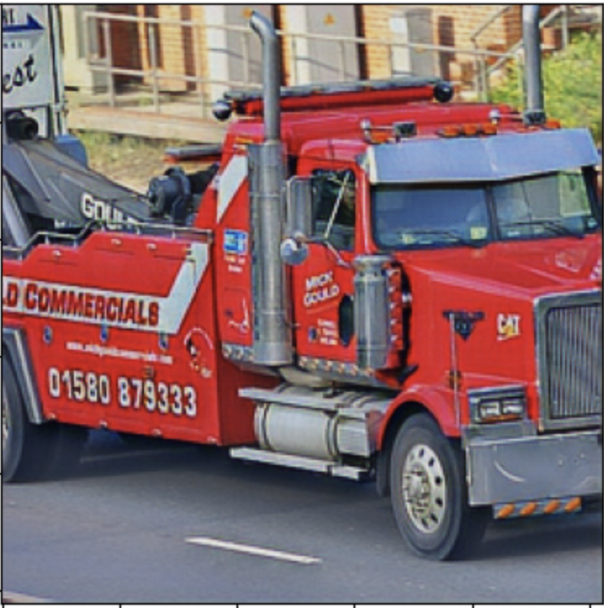
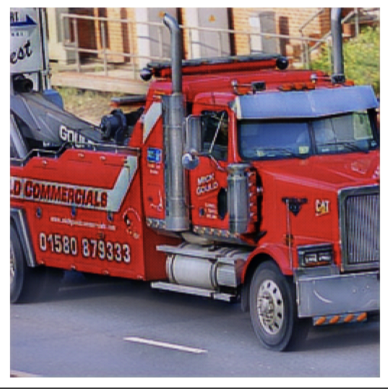

# CSCI1470 Check-in #3 Reflection

**Team Members**: Shiyu Liu, Junhui Huang, Sibo Zhou

---

## Introduction

In this paper, we propose a generative adversarial network (GAN) tailored for cartoon transformation, capable of producing high-quality cartoon images from real-world photographs. Motivated by the recent surge in popularity of ChatGPT’s cartoon outputs, we aim to create our own model and compare its performance against ChatGPT’s results.

---

## Challenges

Throughout the development of this GAN model, we encountered several notable challenges. Debugging and technical troubleshooting consumed a significant portion of our time, particularly as we tackled issues like network convergence, vanishing gradients, and stabilizing the inherently unstable GAN training process. Preparing the dataset also proved more complex than anticipated; curating a balanced and representative set of real-world and cartoon images required extensive effort. Another key challenge was achieving edge smoothness in the generated cartoon images—striking a balance between clear outlines and smooth transitions involved experimenting with different loss functions and fine-tuning hyperparameters. Speaking of which, tuning hyperparameters itself was a difficult and iterative process. Finding the right balance between content loss and adversarial loss demanded many trials with different loss weights and a careful adjustment of the number of warmup epochs. Additionally, limited GPU access meant we had to be particularly mindful of training efficiency to ensure steady progress.

  
  

<em>
Side-by-side comparison illustrating the original photograph (left) and the generated image with cartoon characteristics (right), showcasing the model's capability in transforming realistic details into stylized cartoon aesthetics.
</em>

## Insights

We have achieved preliminary results, illustrated clearly by the cartoon-style output images produced by our model. These images feature distinctively highlighted edges and stylized characteristics consistent with traditional cartoon aesthetics.

- Our model's performance meets expectations and even exceeds them in areas such as edge detection and color representation.
- Computational constraints have limited model refinement, but the results affirm the potential of our GAN architecture and training strategy.

---

## Plan

Our progress is ahead of schedule, providing flexibility for further improvements. Moving forward, we will:

- Allocate additional time and computational resources to enhance image quality and consistency.
- Diversify the dataset for improved generalization.
- Conduct rigorous comparative evaluations to benchmark our results.

These next steps aim to strengthen the credibility and effectiveness of our GAN-based cartoon transformation model.

---
